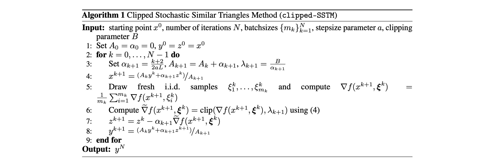
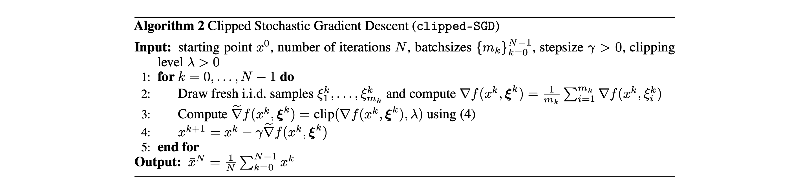

Optimization Methods in Machine Learning, Fall 2023, Innopolis University

**Vladimir Makharev B20-AI, Danil Andreev B20-AI**

# [Stochastic Optimization with Heavy-Tailed Noise via Accelerated Gradient Clipping](https://proceedings.nips.cc/paper_files/paper/2020/file/abd1c782880cc59759f4112fda0b8f98-Paper.pdf)

## Abstract

In this paper, we propose a new accelerated stochastic first-order method called clipped-SSTM for smooth convex stochastic optimization with heavy-tailed distributed noise in stochastic gradients and derive the first high-probability complexity bounds for this method closing the gap in the theory of stochastic optimization with heavy-tailed noise. Our method is based on a special variant of accelerated Stochastic Gradient Descent (SGD) and clipping of stochastic gradients. We extend our method to the strongly convex case and prove new complexity bounds that outperform state-of-the-art results in this case. Finally, we extend our proof technique and derive the first non-trivial high-probability complexity bounds for SGD with clipping without light-tails assumption on the noise.

## Problem

The authors aim to address the problem of stochastic optimization in the presence of heavy-tailed noise in this paper. They propose a new method called Clipped Stochastic Similar Triangles Method (clipped-SSTM) and provide theoretical analysis and complexity bounds for this method. The paper focuses on developing robust optimization techniques that can handle heavy-tailed stochastic gradients and providing high-probability guarantees for convergence, particularly in the context of convex and strongly convex objectives.

## Relevance

The authors describe the relevance of the problem by stating that it appears in various applications of machine learning and mathematical statistics. Many real-world applications involve heavy-tailed noise in stochastic gradients, and existing optimization methods like Stochastic Gradient Descent (SGD) tend to perform poorly in such scenarios.

## Proposed Method

### Main Idea

The main idea of the described solution is to develop stochastic optimization methods that are robust to heavy-tailed noise in stochastic gradients. The paper presents two main methods: Clipped Stochastic Similar Triangles Method (clipped-SSTM) and Clipped Stochastic Gradient Descent (clipped-SGD). These methods incorporate a "clipping" step, where stochastic gradients are adjusted to prevent large, outlier gradients from causing large oscillations and slow convergence.
Clipped-SSTM, designed for convex and L-smooth objectives, achieves complexity bounds comparable to optimal methods under the assumption of light-tailed noise, but it works even when this assumption is not satisfied. The main idea behind clipped-SSTM is to use a clipped stochastic gradient that is robust to the presence of heavy-tailed noise in the gradients.
Similarly, clipped-SGD is introduced to address the same issue in the context of stochastic gradient descent. It includes a clipping operation applied to stochastic gradients to prevent large excursions from the optimal solution. The paper provides complexity bounds for clipped-SGD in both convex and strongly convex cases, even when the assumption of light-tailed noise is not met.
In summary, the main idea is to incorporate gradient clipping into stochastic optimization methods to make them more robust when dealing with stochastic gradients exhibiting heavy-tailed distributions. This robustness ensures convergence with high probability and faster convergence rates in the presence of noise.

### Intuition

The intuition behind the proposed methods is to make stochastic optimization algorithms robust in the presence of heavy-tailed noise in the gradients.
In traditional optimization, stochastic gradients are assumed to have "light tails," meaning they follow a distribution that doesn't have extremely large values. However, in real-world scenarios like machine learning and deep learning, gradients can sometimes have heavy tails, with rare but very large values. When these heavy-tailed gradients are encountered, standard optimization algorithms may behave erratically and have difficulty converging to an optimal solution.
To address this challenge, clipped-SSTM and clipped-SGD introduce the concept of "clipping." Clipping is a process that limits the impact of unusually large gradients by projecting them onto a bounded region. If a gradient is too large, it is scaled down to prevent it from causing large optimization steps. This prevents the algorithm from jumping far away from a potential optimal solution when dealing with rare but extremely large gradients.

### Basis of The Method

The proposed methods are built upon the fundamental concept of gradient clipping, a technique for controlling the magnitude of stochastic gradients in the presence of heavy-tailed noise.
These methods address stochastic optimization problems with heavy-tailed gradients by implementing a two-step approach: first, the stochastic gradients are aggregated and averaged over mini-batches, and second, the result is projected onto a bounded Euclidean ball with a specified radius, thereby clipping any excessively large gradients. This clipping step serves as a key innovation, enabling robust optimization performance even when gradients exhibit extreme values.

### Key Features

The key features of the proposed methods, are as follows:

1. **Robustness to Heavy-Tailed Noise**: a condition where traditional optimization algorithms tend to perform poorly.

2. **Gradient Clipping**: a central element in both methods, which involves projecting the stochastic gradients onto a bounded region.

3. **Complexity Guarantees**: the paper provides high-probability complexity bounds for both clipped-SSTM and clipped-SGD. These complexity bounds outline the number of iterations or oracle calls required to achieve a specified level of optimization accuracy with a certain probability.

4. **Accelerated Variants**: clipped-SSTM is an accelerated method that designed for convex and L-smooth objectives.

5. **Non-Accelerated Variants**: the papers presents non-accelerated variants of clipped-SGD with periodically decreasing clipping levels.

6. **Application to Convex and Strongly Convex Problems**: the proposed methods are applicable to both convex and strongly convex optimization problems.

7. **No Bounded Set Assumption**: unlike some previous methods, clipped-SSTM and clipped-SGD do not assume that the optimization problem is defined on a bounded domain.

8. **Empirical Validation**: the paper includes numerical experiments to validate the effectiveness of the proposed methods.

Trajectories of SGD, clipped-SGD, SSTM and clipped-SSTM applied to solve logistic regression problem on `heart` dataset.

Trajectories of SGD, clipped-SGD, SSTM and clipped-SSTM applied to solve logistic regression problem on `diabetes` dataset.

Trajectories of SGD, clipped-SGD, SSTM and clipped-SSTM applied to solve logistic regression problem on `australian` dataset.